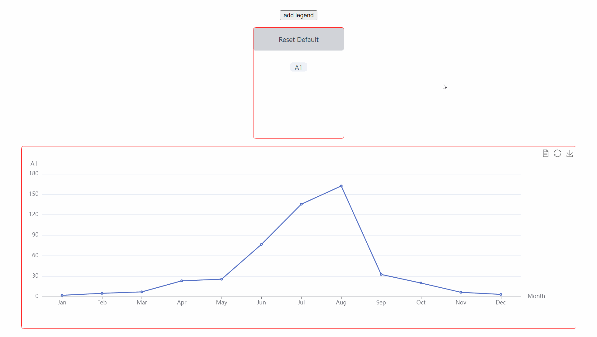
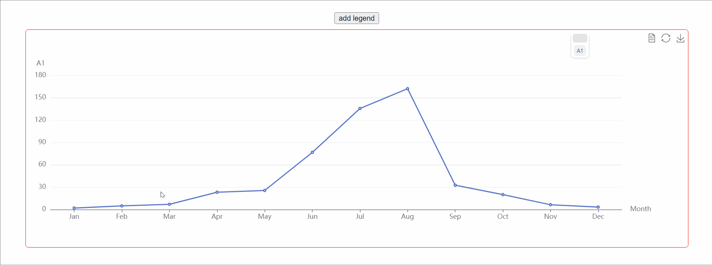

# vue-echarts-drag

This template should help get you started developing with Vue 3 in Vite.

此组件是基于 echarts + vue-draggable-plus 的图例拖拽组件，可以实现图例合并和分离功能。
## 案例演示
**注：** 演示案例中拖拽时会有一些阴影块这是GIF截图软件（LICEcap）造成的，实际运行无此问题。
* 1.初始版本案例

* 2.添加新增功能，模拟series系列数据动态新增

* 3.视频演示

<video src="https://github.com/jiangtao1212/echarts-legend-drage/assets/43814484/f12c0e39-70b0-4a73-8b86-c8184d95b39a" autoplay="true" controls="controls" ></video>

* 4. 位置调整

